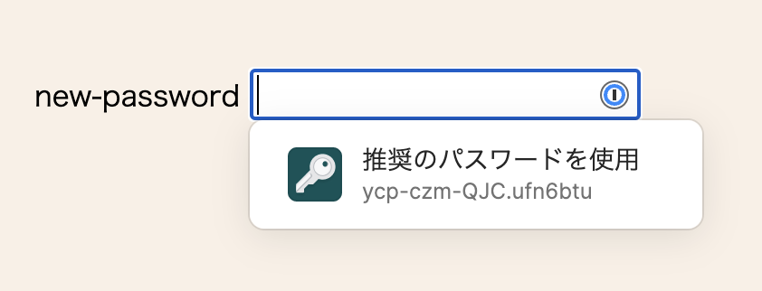
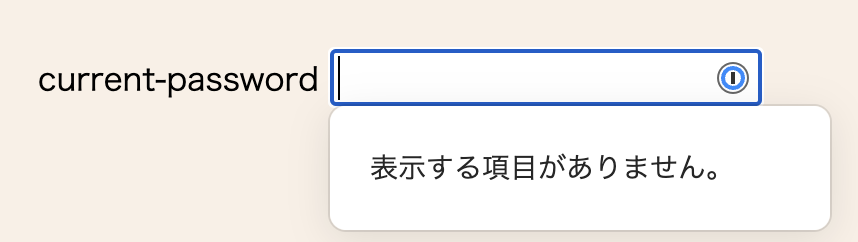
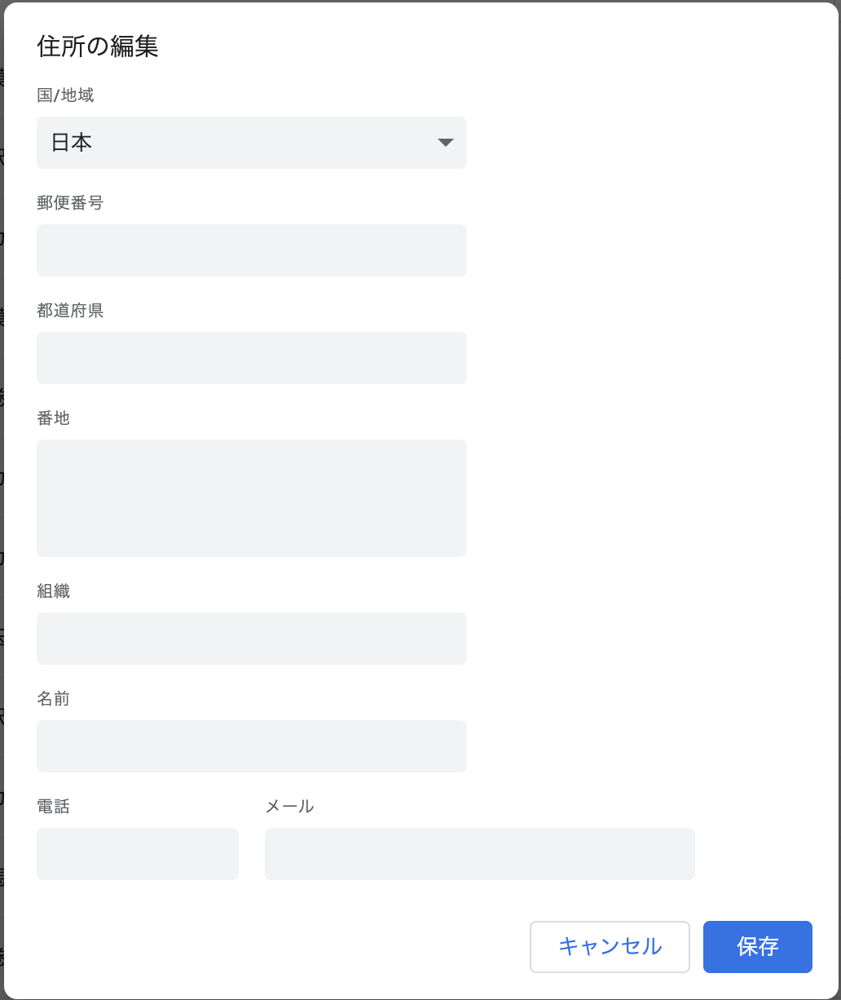
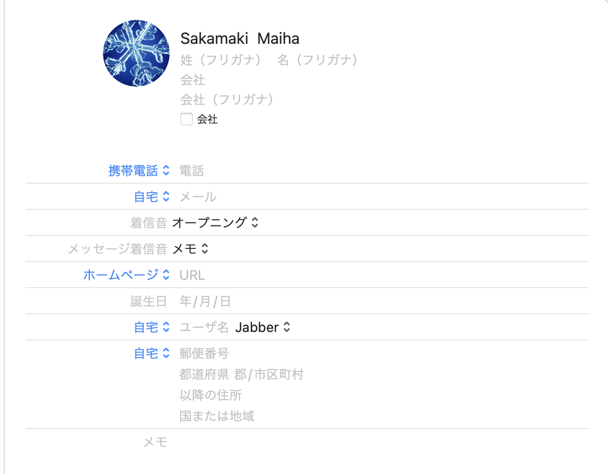
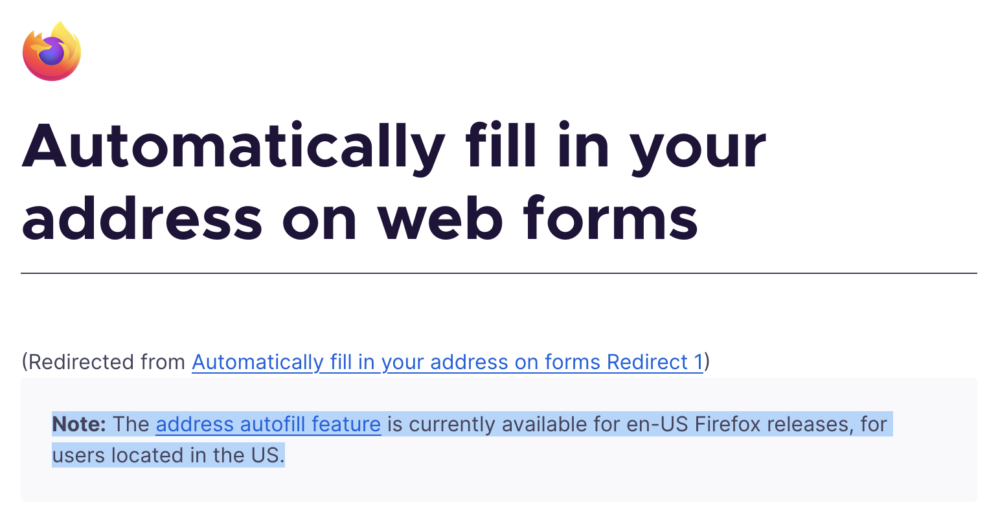

# `input`要素の `autocomplete`属性

---

## `autocomplete` 属性使ってますか？
* ブラウザによってまちまち
* 設定によってもいろいろ

---
### パスワード入力欄の`autocomplete`
パスワード入力欄の`autocomplete`属性には<br>どんな値が入るとよいでしょうか！

```html
<input type="password" autocomplete="????">
```
---
* `new-password`
* `current-password`

---

#### `new-password`
新たなパスワード（例：アカウントを作成するとき／パスワードを変更するとき）



---

#### `current-password`
username 欄で識別されるアカウント用の現在のパスワード（例： ログインするとき）




---
パスワードマネージャをサポートできる
* ブラウザのパスワードマネージャー
* 1Passwordなどのアプリ

---
### `autocomplete` で住所などの入力補助
ブラウザや設定によっていろいろ。

---

### Chrome(Mac)の場合



---
### Safari(Mac)の場合


---
### Firefoxの場合


---

## まとめ
`autocomplete`はまだ情報が少ないし
ブラウザの対応状況もいろいろで使いにくいけど、
`new-password`と`current-password`はおすすめ！

---
### 参考ウェブページ
* [サインインフォームのベストプラクティス - web.dev](https://web.dev/i18n/ja/sign-in-form-best-practices/)
* [Autofilling form controls: the autocomplete attribute - HTML Standard](https://html.spec.whatwg.org/#autofilling-form-controls:-the-autocomplete-attribute)
* [The input element - HTML Standard](https://html.spec.whatwg.org/#the-input-element)

---

### 参考図書
- [Webアプリケーションアクセシビリティ](https://webapp-a11y.com/)
- [フロントエンド開発のためのセキュリティ入門](https://www.shoeisha.co.jp/book/detail/9784798169477)

